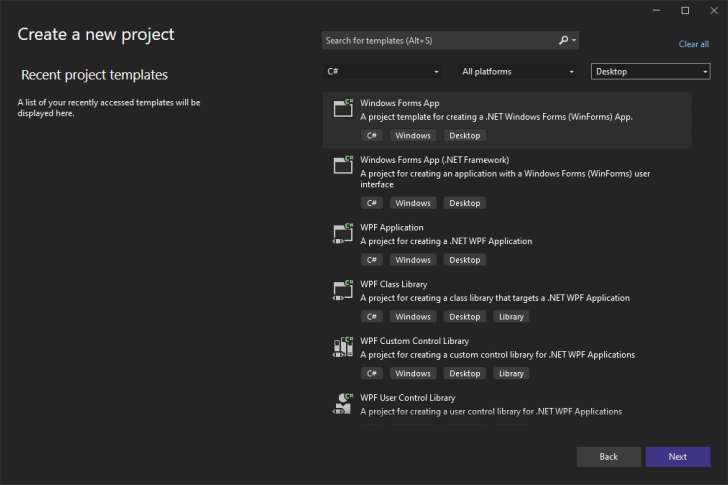
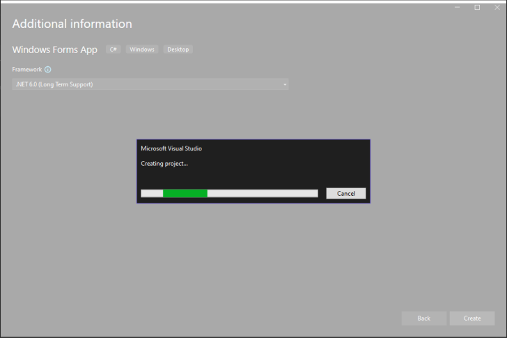
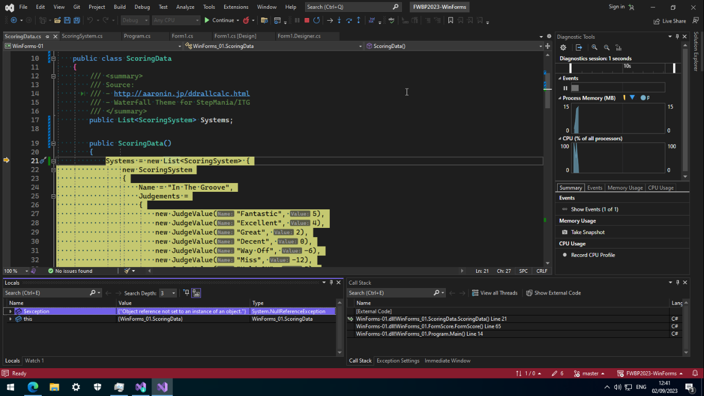
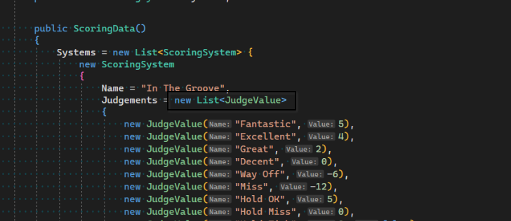
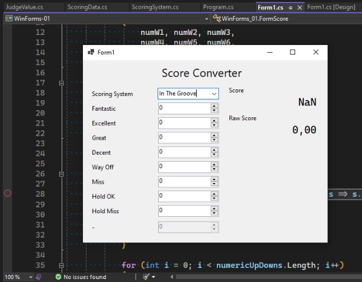
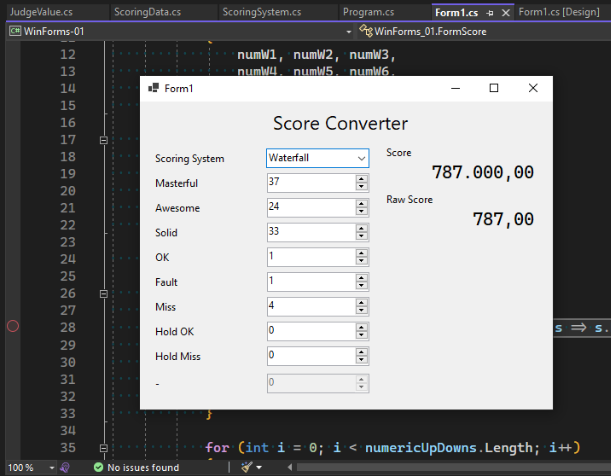
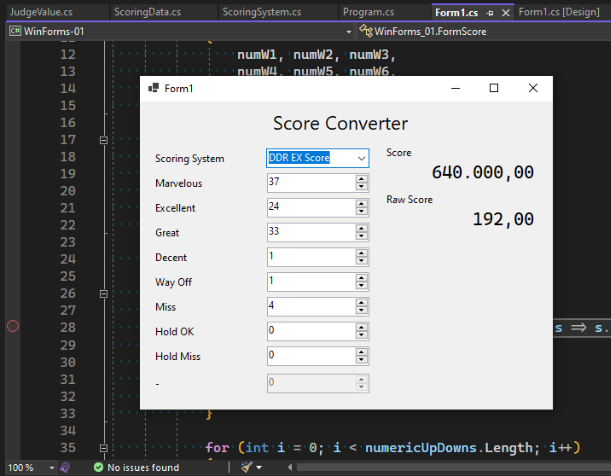
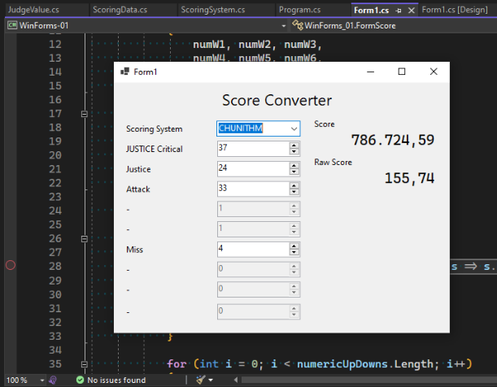
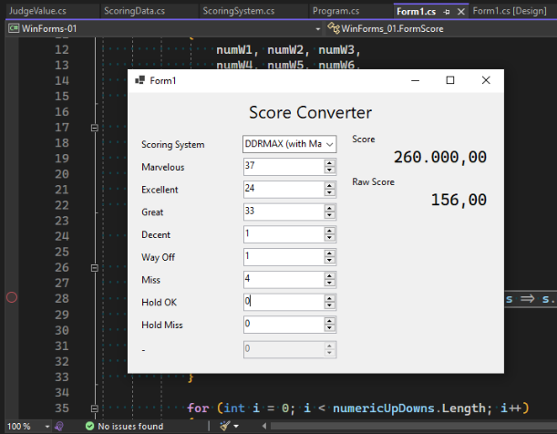

Tugas minggu ini adalah membuat aplikasi Windows Forms. Aplikasi harus bisa menerima input pengguna dan melakukan update pada form.

Untuk proyek WinForms kali ini, saya mengimplementasikan _rhythm game score converter_, dimana perhitungan skor akan berubah tergantung dari jenis _rhythm game_ yang dipilih.

Kesulitan yang saya alami bukanlah dalam membuat form, namun dalam menggunakan data yang saya berikan. Saya dulu punya pengalaman dengan bahasa C# sekitar 6 tahun yang lalu. Ketika itu saya membuat proyek [gim berbasis music menggunakan Unity](https://github.com/HDX13-BeatCode/MathBeat.Unity). Saya kembali mempelajarinya ketika pada mata kuliah Pemrograman Web diminta untuk membuat aplikasi ASP.NET Core. Mohon maaf, saya tidak mempublikasikan kode sumber untuk tugas tersebut.

Kode untuk tugas minggu ini saya taruh di [repositori GitHub milik saya](https://github.com/return215/fwbp2023-winforms/tree/master/WinForms-01).

## Membuat Project

Membuat project di Visual Studio 2022 sangat sederhana dan mudah.





Setelah itu, saya membuat repo Git dan saya _push_ ke GitHub. Membuat layout pun cukup mudah. IDE yang saya pakai berjalan lambat karena CPU pada laptop saya kelas menengah ke bawah, dan menggunakan 8GB RAM pada _virtual machine_ Windows 10 tidak membantu banyak. Setidaknya saya masih bisa menulis kode program yang bisa berjalan. Hampir.

Tetapi sebelumnya, kita bahas dulu struktur data yang saya gunakan.

## Data Skor

Data Skor dibuat mengikuti struktur berikut:

```yaml
Name: name of score system
Judgements: # list of Judge values
  - Name: name of judge 1
    Value: 2 # weight value of judge
    Used: true # whether the judge is used or not
  - Name: name of judge 2
    Value: 1 # weight value of judge
    Used: true # whether the judge is used or not
```

Struktur ini diimplementasikan dalam C# dengan nama [`ScoringSystem`](https://github.com/return215/fwbp2023-winforms/blob/master/WinForms-01/ScoringSystem.cs) dan [`JudgeValue`](https://github.com/return215/fwbp2023-winforms/blob/master/WinForms-01/JudgeValue.cs) untuk daftar nilai _judge_. Detail lebih lanjut dapat dilihat di file masing-masing.

Dalam `ScoringSystem`, saya juga menambahkan fungsi `CalculateScore` yang menerima daftar jumlah tiap _judge_ dan mengembalikan nilai berupa _tuple_ dua bilangan bertipe `double`: skor mentah/asal, dan skor yang dinormalisasi dengan rentang antara 0 dan 1 inklusif.

```cs
public (double, double) CalculateScore(int[] judgeCounts) {
	double score = 0;
	double maxWeight = double.MinValue;
	double totalNotes = 0;
	for (int i = 0; i < Judgements.Count; i++)
	{
		var judge = Judgements[i];
		if (i >= judgeCounts.Length) break;
		if (!judge.Used) continue;

		maxWeight = Math.Max(maxWeight, judge.Value);
		score += judge.Value * judgeCounts[i];
		totalNotes += judgeCounts[i];
	}
	double normalizedScore = score / maxWeight / totalNotes;
	return (score, normalizedScore);
}
```

Potongan kode ini melakukan iterasi untuk tiap _Judgement_ dan jumlah masing-masing. Jika salah satu dari _list_ tersebut habis, hentikan perhitungan. Jika ternyata _Judgement_ tidak terpakai, maka tidak akan masuk perhitungan skor.

Skor dihitung dari hasil jumlah dasi tiap hasil perkalian antara bobot nilai _judge_ dan jumlahnya. Sementara itu, total jumlah and nilai bobot maksimum dicatat dalam variabel terpisah. Nilai `score` adalah skor mentah/asal, sedangakan nilai `normalizedScore` dihitung dari skor asal dibagi bobot maksimum dan total jumlah yang dicatat sebelumnya.

Data ditampung langsung dalam kelas [`ScoringData`](https://github.com/return215/fwbp2023-winforms/blob/master/WinForms-01/ScoringData.cs), dengan melakukan inisialisasi daftar sistem skor dan nilai _Judgement_. Data nilai diambil dari berbagai sumber:

- [Dance Dance Revolution Dance Level Calculator](http://aaronin.jp/ddrallcalc.html)
- Waterfall Theme for StepMania/ITG
- CHUNITHM

Untuk DDRMAX, saya menggunakan varian MIGS agar bisa mewaiki _Judgement_ Marvelous dengan lebih tepat.

Kemudian, saya mengalami kendala saat ingin menggunakan data tersebut yang mengakibatkan program tidak bisa berjalan.

## Terjadi `NullReferenceException`

Ketika mencoba memuat data dari objek `ScoringData`, terjadi `NullReferenceException`. Dengan kata lain, program ingin mencoba mengakses properti `Systems`, namun terbaca sebagai `null`, sehingga program terhenti. Awalnya saya mengira ada kesalahan dalam mengisi data `ComboBox`, namu tidak ada masalah di sana.



Masalah sebenarnya terjadi ketika melakukan inisialisasi list `Judgements`. Memberi nilai pada variabel belum tentu akan membuat objek yang bersangkutan, akhirnya saya tambahkan inisialisasi objek list.



Setelah melakukan perubahan pada sumber data (yang mana hanya data tulis langsung dalam kode), program form akhirnya dapat berjalan.

## Form

Form ini terdiri dari beberapa elemen:
- 1 `ComboBox` untuk memilih sistem skor,
- 9 `NumericUpDown` untuk melakukan input jumlah, dan
- 2 `Label` untuk menampilkan skor.

Tergantung jenis sistem yang dipilih, beberapa _Judgement_ tidak terpakai, ditandai dengan properti `Used` dalam tiap entri `Judgement`. Oleh karena itu, `NumericUpDown` yang tidak dipakai akan dimatikan (`.Enabled = false`). Saya juga tambahkan cek untuk input yang tidak memiliki `Judgement` terkait, namun tidak didemonstrasikan di sini karena semua entri telah tercakup semua.

Secara bawaan, `NumericUpDown` memiliki nilai maksimum 100. Saya ingin lebih dari itu. Jadi saya buka `Form1.Designer.cs`, yang dibuat oleh UI designer, menambahkan nilai maksimum `decimal.MaxValue` secara manual pada tiap kotak angka. Dengan begini, angka sangat besar pun bisa didukung tergantung kemampuan sistem.

Saya lakukan update pada form ketika nilai `ComboBox` atau dalah satu dari `NumericUpDown` berubah. Dalam proses update, data dari form akan diambil dan skor akan dihitung, baik nilai skor mentah maupun nilai skor yang dinormalisasi menjadi rentang 0 hingga 1.000.000.



Nilai input diambil dari video berikut:



Dan berikut hasilnya. Perhatikan, kedua nilai Fantastic dari video dijumlahkan menjadi satu.









Skor DDRMAX terlihat aneh, karena dalam game tersebut Hold OK bernilai tiga kali lipat dari Perfect (tidak sengaja tertulis Excellent dalam form), dan nilai tersebut yang dianggap sebagai nilai bobot maksimum.

## Penutup

Ini hanya sekedar bukti bahwa saya bisa membuat aplikasi WinForms yang dapat berjalan. Alur proses masih dapat diperbaiki, seperti pada kasus DDRMAX.

Tetapi sekian dulu untuk minggu ini, kita lihat kelanjutannya di materi minggu depan.
