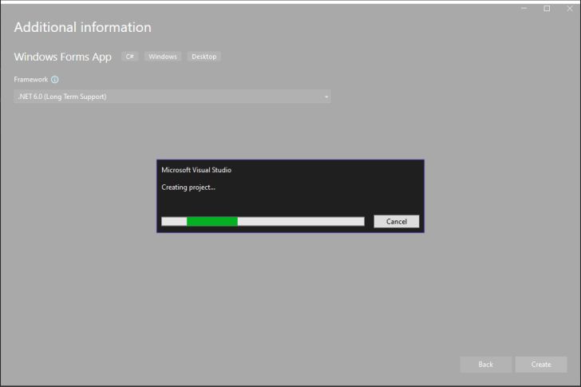
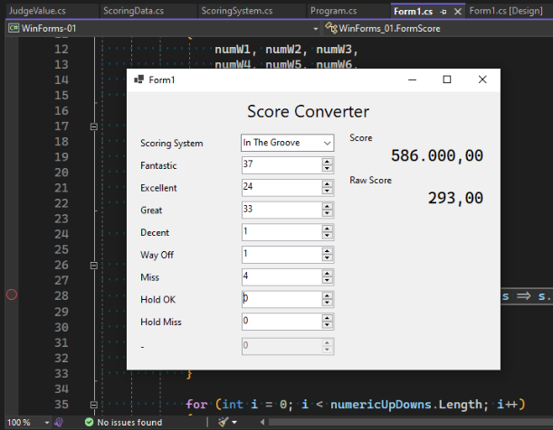
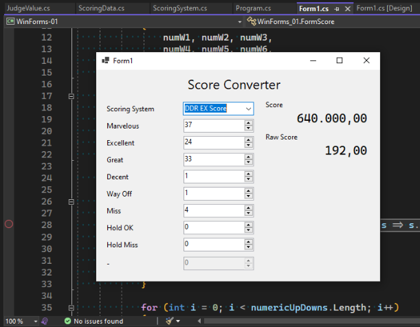

The task at hand is to create a working Windows Forms application. It should be able to receive user input through form controls and update the form accordingly.

For this WinForms project, I decided to implement a rhythm game score converter, where it will change the scoring system based on the type of game selected.

The biggest challenge, however, is not making the form to work, but to make the data I create to initialize properly. You see, I had experience with C# before, but that was 6 years ago, when I was making [a basic rhythm game in Unity](https://github.com/HDX13-BeatCode/MathBeat.Unity). I had picked up the language again for a bit when taking the Web Programming course a while back. We were told to create an ASP.NET Core full-stack application with it. However, there is no public code for that. Sorry.

The code for this week's project can be seen on [my GitHub repository](https://github.com/return215/fwbp2023-winforms/tree/master/WinForms-01).

## Creating the Project

Creating a new project in Visual Studio 2022 is as simple as ever.




After creating the project, I initialized a Git repository and pushed it onto my GitHub. Dragging the layout was straightforward as well. The IDE is a bit slow because of my low-end CPU, and my 8GB RAM for this Windows 10 VM isn't helping much. Otherwise, I managed to write a code that works. Or so I thought.

But before we get there, let's talk about the data I use and how I structure them.

## The Scoring Data

The scoring data is made of the following structure:

```yaml
Name: name of score system
Judgements: # list of Judge values
  - Name: name of judge 1
    Value: 2 # weight value of judge
    Used: true # whether the judge is used or not
  - Name: name of judge 2
    Value: 1 # weight value of judge
    Used: true # whether the judge is used or not
```

The structure is then implemented in C# accordingly as [`ScoringSystem`](https://github.com/return215/fwbp2023-winforms/blob/master/WinForms-01/ScoringSystem.cs) and [`JudgeValue`](https://github.com/return215/fwbp2023-winforms/blob/master/WinForms-01/JudgeValue.cs) for the list of judgements. More details can be seen on the respective source files.

Also in `ScoringSystem`, I added a method to `CalculateScore` given a set of numbers that correspond to each judgement. The function returns a tuple of two double-precision floating point numbers: a raw score, and a normalized score in the range of 0 to 1 inclusive.

```cs
public (double, double) CalculateScore(int[] judgeCounts) {
	double score = 0;
	double maxWeight = double.MinValue;
	double totalNotes = 0;
	for (int i = 0; i < Judgements.Count; i++)
	{
		var judge = Judgements[i];
		if (i >= judgeCounts.Length) break;
		if (!judge.Used) continue;

		maxWeight = Math.Max(maxWeight, judge.Value);
		score += judge.Value * judgeCounts[i];
		totalNotes += judgeCounts[i];
	}
	double normalizedScore = score / maxWeight / totalNotes;
	return (score, normalizedScore);
}
```

The code will iterate through each Judgement and its respective count. If either of the list ends, the calculation stops. If the judge is not used, then it will not count towards the score. 

The calculation takes the product of the respective judge's value and its count, then sums it up, while tracking the total count and the maximum weight given in the scoring system. The `score` is the raw value as above, meanwhile the `normalizedScore` is calculated after score and is divided by the maximum weight and the total count.

The data is stored in the [`ScoringData`](https://github.com/return215/fwbp2023-winforms/blob/master/WinForms-01/ScoringData.cs) class, initializing the list of scoring systems and its judge values. The numbers are based from various sources:

- [Dance Dance Revolution Dance Level Calculator](http://aaronin.jp/ddrallcalc.html)
- Waterfall Theme for StepMania/ITG
- CHUNITHM

For DDRMAX, I am using the MIGS variant to better reflect the accuracy when getting a Marvelous judgement.

However, when trying to use these values, I made a mistake that causes the form to not run.

## The Dreaded `NullReferenceException`

When trying to load data from the `ScoringData` object, it threw `NullReferenceException`. In other words, my program tried to access `Systems` field, but it was `null`, therefore crashing the program. Initially I thought I initialize the `ComboBox` wrong, but it turns out I was doing it right already.


The problem was actually where I tried to initialize `Judgements` list. Simply assigning a value there won't create the object, so I fixed that by creating the list object.


After modifying the data source (which is just pre-instantiated data), the form finally worked well.

## The Form

The form consists of several fields:
- 1 `ComboBox` to select preferred scoring system to use,
- 9 `NumericUpDown` fields to enter the numbers, and
- 2 `Label`s to show the score.

Depending on the game, some judgements may not be used, indicated by the `Used` field in each `Judgement` entry. To reflect this, the respective `NumericUpDown` field is disabled (`.Enabled = false`). I also do some sanity checks to disable any other fields that may not have a corresponding `Judgement`, but I do not demonstrate it here, since my data covers all of the fields so far.

By default, `NumericUpDown` has a maximum value of 100. I do not want this, therefore I want to change it. The way I do it is to open up the `Form1.Designer.cs`, the file that is intended to be used for the graphical layout designer, and add the entry manually referencing to `decimal.MaxValue` to each of the number box. This way, I don't need to change the numbers manually and it will be safe as it follows system implementation.

I make the form update its views whenever the value in the `ComboBox` changes or any of the `NumericUpDown` fields changes. This will take the count input and calculate the score (with the maximum score of 1.000.000) and the raw score (which directly correlates to the original weighted values of each `Judgement`).


The input value is based on the following video:



And here is the resulting input. Note that the two Fantastic entries are added together here.







The DDRMAX case is weird, because for some reason Hold OK worth three times as Perfect (I mistyped it as Excellent), and that is treated as the maximum weight.

## What's Next

This is just a proof-of-concept that I am able to create a working WinForms app. The business logic still needs improving, as it is the case with DDRMAX. For example, I could separate the tracking for regular notes and hold notes so that the score would show correctly.

But I will leave it there for this week and perhaps polish it the next week, depending on the topic to be covered later.
