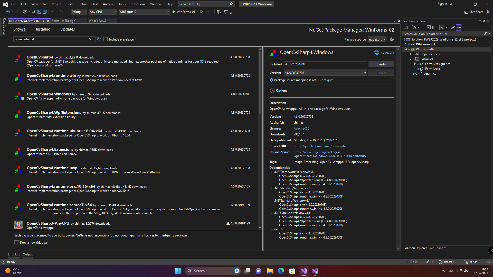
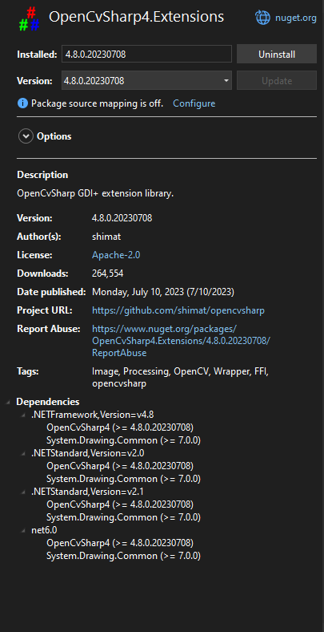
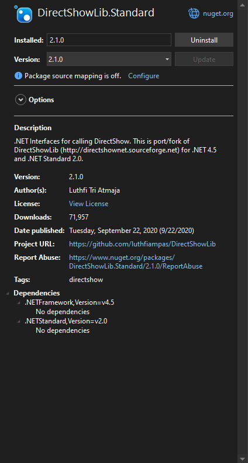
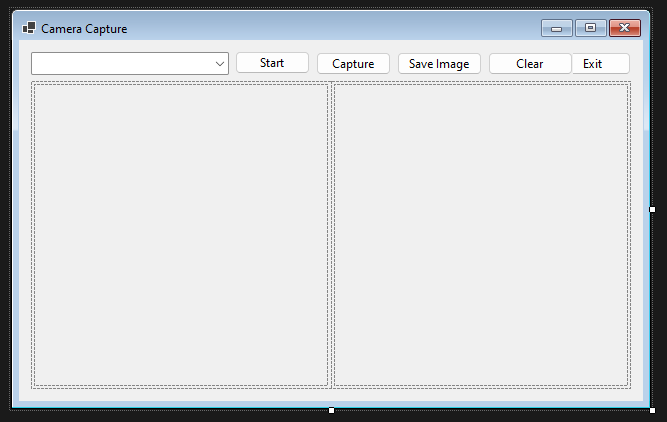

In the [last project](../week01/), I built and ran the program in a VM. Now the problem is that I cannot use my webcam through QEMU. I could find a way to pass the webcam through or use a fake virtual webcam, but it's too much effort.

Instead, I went into the GiGa (Graphics, Interaction, and video Games) lab and borrow a computer there. I chose that lab because I believe they should have a webcam. Otherwise, it wouldn't be a graphics lab. I was right, they let me use one of their computers and lent a webcam for use.

From there, I got to work. But instead of following [the tutorial](https://www.youtube.com/watch?v=HUiV10g1VLU) and using AForge, I decided to go low and use OpenCV. It was quite a hassle to get it to work, but once it worked, everything went swimmingly.

As usual, the code for this week's assignment is in [my public GitHub Repository](https://github.com/return215/fwbp2023-winforms/tree/master/WinForms-02).

## Getting the libraries

Unlike the tutorial who went on their way to download DLLs from the source website, I use a different approach. It is not as safe as the former method, but it is more convenient to me as the dependencies are tracked.

The method I use is downloading the libraries through NuGet. The way I do it is by right-clicking on the project and selecting "Manage NuGet packages". There, I can just search for the libraries I need. For this project, I use three packages:

- OpenCvSharp4 for Windows
- OpenCvSharp4 extensions
- DirectShowLib







But first, what is OpenCV? Well, it's an open source library for computer vision. AForge is similar to OpenCV, but runs under a different license. Although I can [use it alongside AForge](https://stackoverflow.com/a/4775120), I personally refuse to use it for now. Also, AForge uses LGPL for licensing (and GPL for older versions and specific components), while OpenCV uses Apache license (from 4.5.0). But regardless of license, you should choose whichever you like. I may plan to use OpenCV in the future, so I might as well jump in.

## The Form Layout



The form is a 640x400 window with a combo box, five buttons, a table layout, two picture boxes inside the table, and a label.

- The combo box will list the capture devices
- "Start" button to start capturing from the selected device
- "Capture" to take a snap from the capture device
- "Save image" to save the captured image as shown in the output to a file
- "Clear" to clear the image snapshot
- "Exit" to close the form
- A label (not shown in this screenshot) to show the name and location of the captured image

## Setting up the capture device(s)

In order to remain faithful to the design of the original, I would like the program to be able to handle switching between multiple devices. The first thing in order is to get the list of devices to be used by `OpenCVSharp`. But there's [a problem](https://stackoverflow.com/q/64165484).

```csharp
var videoCapture = new VideoCapture(0);
```

In this method, you are required to pass the device by its index as reported by the library. However, just passing the number itself may not work properly, especially on multiple devices with a user-specified default camera. OpenCV index 0 may not necessarily be device index 0, as reported in the problem linked above.

The solution is to pick one particular backend and stick to it. In this case, I am using DirectShow backend, hence I installed `DirectShowLib` to help me in this process. Luckily, `DsDevice` has just the method for it.

```csharp
var devices = DsDevice.GetDevicesOfCat(FilterCategory.VideoInputDevice);
```

This method will return a `List<DsDevice>` in the order that DirectShow expects it to have. Then, just assign an ascending number to each device alongside its device path and name if desired. Here's a more complete listing:

```csharp
public static class CameraDevicesEnumerator
{
	public static List<CameraDevice> GetAllConnectedCameras()
	{
		var cameras = new List<CameraDevice>();
		var videoInputDevices = DsDevice.GetDevicesOfCat(FilterCategory.VideoInputDevice);
		int openCvId = 0;
		return videoInputDevices.Select(v => new CameraDevice()
		{
			DeviceId = v.DevicePath,
			Name = v.Name,
			OpenCvId = openCvId++
		}).ToList();
	}
}

public struct CameraDevice
{
	public int OpenCvId { get; set; }
	public string Name { get; set; }
	public string DeviceId { get; set; }
}
```

Once it's done, we can use these values inside a `ComboBox` to allow selection. All we need to do is specify its `DataSource` and set the values accordingly.

```csharp
public void FormVideoCapture_Load(object sender, EventArgs e)
{
	// initialize combo box
	var dataSource = CameraDevicesEnumerator.GetAllConnectedCameras();
	comboDevice.DataSource = dataSource;
	comboDevice.DisplayMember = "Name";
	comboDevice.ValueMember = "OpenCvId";
	comboDevice.SelectedIndex = 0;
}
```

The values from the `ComboBox` can then be used to initialize our camera capture.

```cs
public void StartCapture()
{
	// make sure the type is CameraDevice
	if (comboDevice.SelectedItem is not CameraDevice selectedItem)
		return;

	var index = selectedItem.OpenCvId;
	if (!captureDev.Open(index, VideoCaptureAPIs.DSHOW))
	{
		MessageBox.Show($"Unable to open camera {selectedItem.Name ?? "Unknown"}.");
		return;
	}

	btnStart.Text = "Stop";
	bgwRender.RunWorkerAsync();
}
```

We will cover `bgwRender` right after this. But up until this point, our video device is all set up.

## Capturing the feed

The `bgwRender` component is a background worker, and you should add that through the Designer. This worker handles the update of the preview. I also set the properties `WorkerReportsProgress` and `WorkerSupportsCancellation` to `true` so that we can update the preview `PictureBox` every frame and stop the capture as we wish. I choose 60 FPS as the update rate, but you can choose any number if you wish.

```cs
private void bgwRender_DoWork(object sender, System.ComponentModel.DoWorkEventArgs e)
{
	BackgroundWorker worker = sender as BackgroundWorker;
	while (!worker.CancellationPending)
	{
		worker.ReportProgress(0, CaptureFrame());
		Thread.Sleep(1000 / frameUpdatesPerSec);
	}
}
```

The meat of this program is the capturing of the frames. This is where the `OpenCvSharp.Extensions` comes in with `BitmapConverter`. This method takes the image data (in the form of a Material) and converts it into a bitmap data. The Bitmap data is internal to C#, so it can be easily recognized by other classes such as our `PictureBox`es.

```cs
public Bitmap CaptureFrame()
{
	using (var mat = captureDev.RetrieveMat())
	{
		var frameBitmap = BitmapConverter.ToBitmap(mat);
		return frameBitmap;
	}
}
```

Once we get the bitmap data, we can use it inside our `PictureBox`es.

```cs
private void bgwRender_ProgressChanged(object sender, System.ComponentModel.ProgressChangedEventArgs e)
{
	Bitmap bitmap = e.UserState as Bitmap;
	// clear previous image
	picPreview.Image?.Dispose();
	picPreview.Image = bitmap;
}

private void btnCapture_Click(object sender, EventArgs e)
{
	Bitmap bitmap = CaptureFrame();
	// clear previous image
	picCaptured.Image?.Dispose();
	picCaptured.Image = bitmap;
	labelSavedImage.Text = "";
}
```

Finally, it's time to save our image. I choose to save in the user's Pictures folder as a JPEG file with the filename `Capture_yyyy-MM-dd_HH-mm-ss.jpg`. Unfortunately I forgot to handle empty images, so a fix may be issued later. The article and the source will be updated accordingly.

```cs
private void btnSave_Click(object sender, EventArgs e)
{
	var picturesDir = Environment.GetFolderPath(Environment.SpecialFolder.MyPictures);
	var finalPath = $@"{picturesDir}\Capture_{DateTime.Now:yyyy-MM-dd_HH-mm-ss}.jpg";
	picCaptured.Image.Save(finalPath, System.Drawing.Imaging.ImageFormat.Jpeg);
	labelSavedImage.Text = $"Saved to {finalPath}";
}
```

For extra style points, I also implemented stopping of the video capture, clearing of the preview when stopped, clearing of captured image, and a prompt that says where the image is saved. All that and much more can be seen in my source repo.

## Results


## Credits

Thank you once again to the folks at GiGa that allow me to use their lab for this assignment.

I couldn't have done it without the help of the following projects:
- [WebcamControl WPF With OpenCV](https://github.com/FrancescoBonizzi/WebcamControl-WPF-With-OpenCV)
- [OpenCVSharp sample codes](https://github.com/shimat/opencvsharp_samples)
